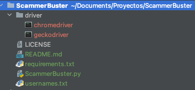

#ScamBuster

###Description
*ScamBuster* is a simple script used to gather sensitive basic information via command line. It is intended to help in the OSINT process, being used to get potential phone numbers, addresses, emails and pictures from instagram **public** or **followed** accounts.  

It can cross the following accounts from Instagram and try to check if multiple scammer profiles (or other kind of profiles) have some people following in common. It does it this way because they may be the real scammer profiles (auto-followed by him).  

It makes use of [instagrapi](https://github.com/adw0rd/instagrapi) to login and perform requests and, since **instagrapi** is not perfect, it may lead to the ban of the instagram account used, so **USE IT WITH CAUTION**.

###Usage
    usage: ScammerBuster.py [-h] -f FILE -u USERNAME -p PASSWORD [-s]
    
    optional arguments:
        -h, --help                         Show this help message and exit
        -s, --osm                          Search for username in other social media (Twitter and TikTok)
    mandatory arguments:
        -f FILE, --file FILE                File from where retrieve usernames to analyze
        -u USERNAME, --username USERNAME    Your instagram username
        -p PASSWORD, --password PASSWORD    Your instagram password

###Installation
    pip3 install -r requirements.txt

### Twitter and Tiktok Detection
In order to check if users have similar accounts (and also for further development) on TikTok and Twitter, I have used [Selenium](https://www.selenium.dev/) (Trust me, it is way better than pyppeteer or Playwright in this case).  

So, I have added a new flag called **-osm** (Other Social Media) that can be used if you have downloaded the appropriate driver (check Selenium Drivers [here](https://www.selenium.dev/documentation/webdriver/getting_started/install_drivers/)). You can put it into *./driver* folder or set the path in *check_twitter_and_tiktok()* function.

 - File tree:

 
###Future work
- [ ] Search for similar accounts and recommend them
- [ ] Add Twitter and TikTok analytics functionality and cross it with the one from Instagram
- [ ] Improve timing and banning problems
- [ ] Add file saving functionalities

###Legal disclaimer and resposibilities
*I don't aim anybody to use this tool in a non-legal way. This tools is only intended for researching and I don't take any responsibilities regarding Intagram account normative nor any potential ban of personal accounts.*